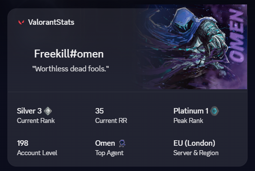
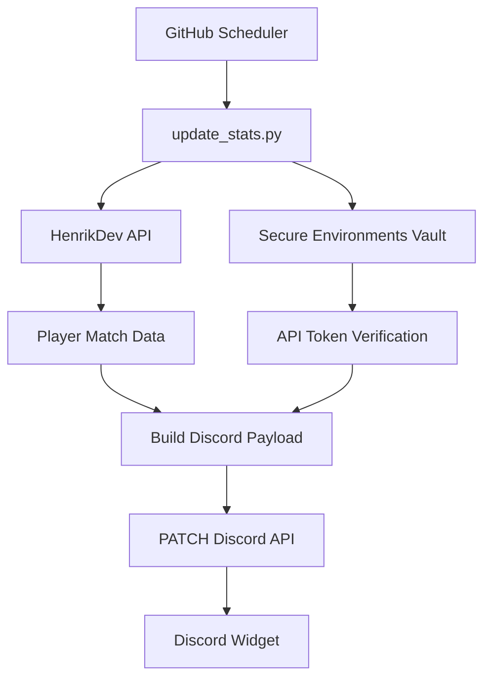

# 🎯 Discord Dynamic Valorant Profile Widget

<div align="center">
  
</div>

> **Real-Time Valorant Discord Widget Automation powered by
> HenrikDev API & GitHub Actions**

Automatically synchronize your public **Valorant** competitive statistics with
Discord's **Dynamic Profile Widget** using **HenrikDev API**,
**Python**, and **GitHub Actions**. No VPS, database, or always-on
server required.

------------------------------------------------------------------------


------------------------------------------------------------------------

## 📸 Preview

<p align="center">
  
</p>

------------------------------------------------------------------------

## ✨ Overview

This project fetches your public player profile from the HenrikDev API,
converts it into Discord's Dynamic Widget payload format, and
automatically updates your Discord profile on a schedule.

### ✅ Features

-   🎮 Competitive Rank Tier
-   🌍 Account Region Config
-   📈 Ranked Rating Progress (RR)
-   🏆 Lifetime Peak Rank Tracker
-   ⚡ Account Level Progress
-   ✍️ Custom Widget Profile Branding
-   ⚡ Fully automated updates via GitHub Actions

### 🏗 Infrastructure

-   GitHub Actions
-   Python 3.x
-   Discord Widget API
-   HenrikDev Unofficial Valorant API
-   REST API Automation

> ✅ No VPS\
> ✅ No server\
> ✅ No database\
> ✅ Runs entirely on GitHub Actions

------------------------------------------------------------------------

## ⚙️ How It Works

1.  GitHub Actions triggers on schedule or manually.
2.  `update_stats.py` fetches your current profile from HenrikDev API.
3.  The runtime pulls your live Rank, RR, Peak Rank, and Account level data.
4.  Everything is transformed into a custom Discord widget grid payload.
5.  Discord API receives a secure PATCH request using your bot token.
6.  Your widget updates automatically.

------------------------------------------------------------------------

## 🚀 Setup

### 1. Fork this repository

### 2. Create a Discord Application

### be advised that this requires knowing what you're doing, along with browser devtools knowledge!
2.1 Go to the [Discord Developer Portal](https://discord.com/developers/applications).
> the warning only applies if you are manually creating your widget!
- 2.1.a. use this [widget creation script](https://gist.github.com/aamiaa/7cdd590e3949cd654758bc90bcb4710b) by aamia (automatic). 
- 2.1.b. if you want to manually go thru the creation process, follow the steps in this [blog post](https://chloecinders.com/blog/discord-widgets) by chloecinders to create your discord application, social sdk profile and widget design.
2.  Copy the **Application ID** (`DISCORD_CLIENT_ID`) and the
    **Bot Token** (`DISCORD_BOT_TOKEN`).
3.  Create your **Dynamic Profile Widget** and bind the fields listed
    in [Widget Fields](#-widget-fields) below.

### 3. Add GitHub Secrets

**Repository → Settings → Secrets and variables → Actions → New repository secret**

| Secret              | Value                               |
|---------------------|-------------------------------------|
| `VAL_API_KEY`       | Your HenrikDev API Access Key       |
| `VAL_REGION`        | na, eu, ap, kr, latam, br           |
| `VAL_NAME`          | Your Riot Name                      |
| `VAL_TAG`           | Your Riot Tag                       |
| `DISCORD_BOT_TOKEN` | Discord Bot Token                   |
| `DISCORD_USER_ID`   | Discord User ID                     |
| `DISCORD_APP_ID`    | Discord App ID                      |

### 4. Run it

Open **Actions → Update Valorant Widget → Run workflow**. After the
first successful run, it updates automatically every 10 minutes.

**Local development:**

``` bash
pip install -r requirements.txt
python update_stats.py
```
------------------------------------------------------------------------

## 🧩 Widget Fields

Bind these field names in your Discord widget design:

| Field       | Type   | Example                        |
|-------------|--------|--------------------------------|
| `rank_name` | Text   | Silver 2                       |
| `rank_rr`   | Number | 46                             |
| `rank_peak` | Text   | Gold 1                         |
| `level`     | Number | 196                            |
| `rank_icon` | Number | Rank Icon                      |
------------------------------------------------------------------------
## 🏗 System Architecture



------------------------------------------------------------------------

## ⚙️ How It Works

1.  GitHub Actions triggers on schedule or manually.
2.  `update_stats.py` fetches your current profile data from the HenrikDev API.
3.  The workflow pulls your active competitive status tier, current RR, career peak rank, and player account level.
4.  Everything is transformed into a clean Discord profile widget configuration payload.
5.  Discord API receives a secure PATCH network routing request via your Bot configuration token.
6.  Your profile layout design widget updates instantly.

------------------------------------------------------------------------

## 🌐 APIs Used

### HenrikDev Valorant API

``` text
[https://api.henrikdev.xyz/valorant/v2/mmr/](https://api.henrikdev.xyz/valorant/v2/mmr/){region}/{name}/{tag}
[https://api.henrikdev.xyz/valorant/v1/account/](https://api.henrikdev.xyz/valorant/v1/account/){name}/{tag}
```

### Discord Widget API

``` http
PATCH [https://discord.com/api/v9/applications/](https://discord.com/api/v9/applications/){APP_ID}/users/{USER_ID}/identities/0/profile
```

------------------------------------------------------------------------

## 📦 Example Payload

``` json
{
  "username": "Freekill#omen",
  "data": {
    "primary": {
      "rank_name": "Silver 2"
    },
    "dynamic": [
      { "type": 1, "name": "rank_rr", "value": "46" },
      { "type": 1, "name": "rank_peak", "value": "Gold 1" },
      { "type": 1, "name": "level", "value": "196" }
    ]
  }
}
```

------------------------------------------------------------------------

## 🤖 GitHub Actions

Workflow:

``` text
.github/workflows/update.yml
```

Schedule:

``` yaml
schedule:
  - cron: "*/10 * * * *"
```

Manual execution is also supported via Run workflow.

ℹ️ GitHub scheduled runs can be delayed a few minutes under load;
the runtime intervals will auto-correct on succeeding schedule runs.

------------------------------------------------------------------------

``` text
Valorant-Stats/
├── update_stats.py
├── preview.png
└── .github/
    └── workflows/
        └── update.yml
```
